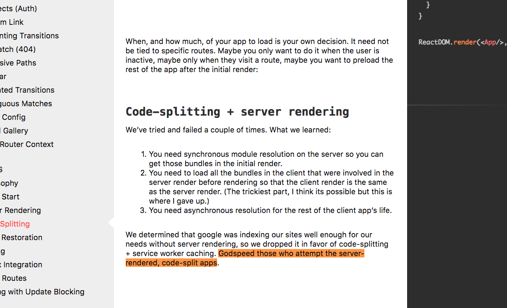
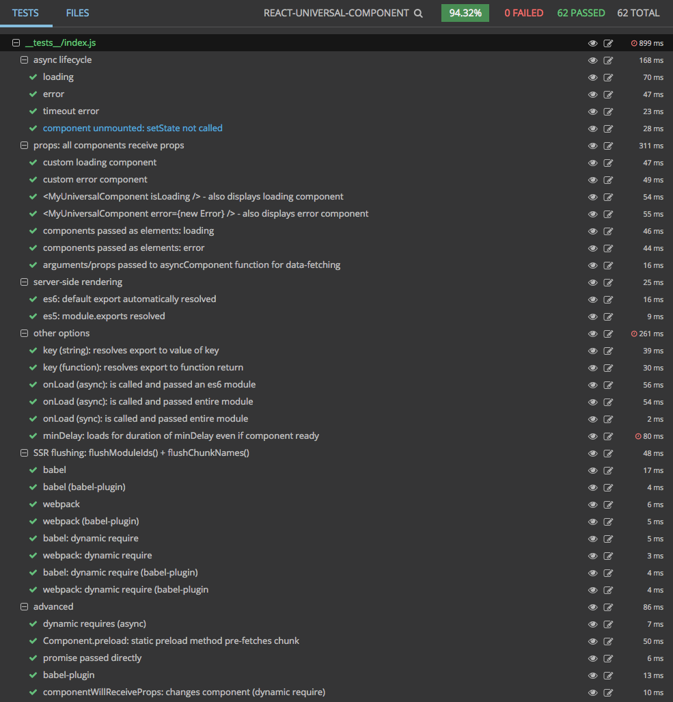
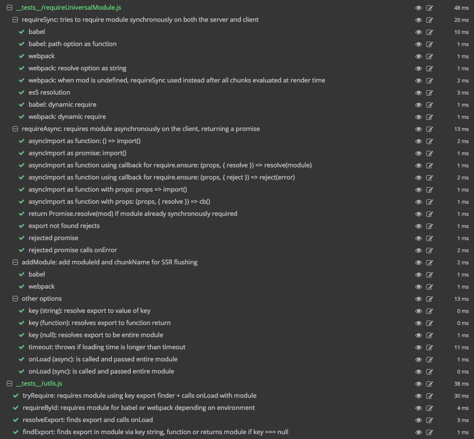

<a href="https://gitter.im/Reactlandia/Lobby" target="_blank">
  
</a>

<a href="https://stackblitz.com/edit/react-pnzphy" target="_blank">
  
</a>

<a href="https://codesandbox.io/s/github/faceyspacey/redux-first-router-codesandbox/tree/master/?module=r1oVP5YEUZ" target="_blank">
  
</a>


# React Universal Component

<p align="center">
  <a href="https://www.npmjs.com/package/react-universal-component">
    
  </a>

  <a href="https://travis-ci.org/faceyspacey/react-universal-component">
    
  </a>

  <a href="https://lima.codeclimate.com/github/faceyspacey/react-universal-component/coverage">
    
  </a>

  <a href="https://www.npmjs.com/package/react-universal-component">
    
  </a>

  <a href="https://www.npmjs.com/package/react-universal-component">
    
  </a>
</p>


<p align="center">
  
</p>

<p align="center">
🍾🍾🍾 <a href="https://github.com/faceyspacey/universal-demo">GIT CLONE 3.0 LOCAL DEMO</a> 🚀🚀🚀
</p>

- [React Universal Component](#react-universal-component)
  * [Intro](#intro)
  * [What makes Universal Rendering so painful](#what-makes-universal-rendering-so-painful)
  * [Installation](#installation)
  * [Other Packages You Will Need or Want](#other-packages-you-will-need-or-want)
  * [API and Options](#api-and-options)
  * [Flushing for SSR](#flushing-for-ssr)
  * [Preload](#preload)
  * [Static Hoisting](#static-hoisting)
  * [Props API](#props-api)
  * [Custom Rendering](#custom-rendering)
  * [Usage with CSS-in-JS libraries](#usage-with-css-in-js-libraries)
  * [Usage with two-stage rendering](#usage-with-two-stage-rendering)
  * [Universal Demo](#universal-demo)
  * [Contributing](#contributing)
  * [Tests](#tests)
  * [More from FaceySpacey](#more-from-faceyspacey-in-reactlandia)


## Intro

For "power users" the traditional SPA is dead. If you're not universally rendering on the server, you're at risk of choking search engine visibility. As it stands, SEO and client-side rendering are not a match for SSR. Even though many search engines claim better SPA indexing, there are many caveats. **Server-side rendering matters: [JavaScript & SEO Backfire – A Hulu.com Case Study](https://www.elephate.com/blog/javascript-seo-backfire-hulu-com-case-study/)**


The real problem has been **simultaneous SSR + Splitting**. If you've ever attempted such, *you know*. Here is a one-of-a-kind solution that brings it all together.

*This is the final universal component for React you'll ever need, and it looks like this:*

```js
import universal from 'react-universal-component'

const UniversalComponent = universal(props => import(`./${props.page}`))

export default () =>
  <div>
    <UniversalComponent page='Foo' />
  </div>
```

It's made possible by our [PR to webpack](https://github.com/webpack/webpack/pull/5235) which built support for ```require.resolveWeak(`'./${page}`)```. Before it couldn't be dynamic--i.e. it supported one module, not a folder of modules.

Dont forget to check out  [webpack-flush-chunks](https://github.com/faceyspacey/webpack-flush-chunks) - it provides the server with info about the render so it can deliver the right assets from the start. No additional async imports on first load. [It reduces time to interactive](https://developers.google.com/web/tools/lighthouse/audits/time-to-interactive)

> DEFINITION: "Universal Rendering" is *simultaneous* SSR + Splitting, not trading one for the other.


<details> <summary> Read more about Chunk Flushing</summary>

Gone are the days of holding onto file hashes, manual loading conventions, and elaborate lookups on the server or client. You can frictionlessly support multiple components in one HoC as if imports weren't static. This seemingly small thing--we predict--will lead to universal rendering finally becoming commonplace. It's what a universal component for React is supposed to be.

[webpack-flush-chunks](https://github.com/faceyspacey/webpack-flush-chunks) brings it together server-side Ultimately that's the real foundation here and the most challenging part. Packages in the past like *React Loadable* did not address this aspect. They excelled at the SPA. In terms of universal rendering, but stumbled on provisioning whats required beyond the scope of knowing the module IDs that were rendered. There are a few extras to take into account.

**Webpack Flush Chunks** ensures you serve all the chunks rendered on the server to the client in style. To be clear, it's been impossible until now. This is the first general solution to do it, and still the only one. You *must* use it in combination with React Universal Component to fulfill the universal code splitting dream.
</details>


## Installation

```yarn add react-universal-component```

*.babelrc:*
```js
{
  "plugins": ["universal-import"]
}
```

> For Typescript or environments without Babel, just copy what [babel-plugin-universal-import](https://github.com/faceyspacey/babel-plugin-universal-import) does.


**Reactlandia Articles:**

- **[code-cracked-for-ssr-plus-splitting-in-reactlandia](https://medium.com/@faceyspacey/code-cracked-for-code-splitting-ssr-in-reactlandia-react-loadable-webpack-flush-chunks-and-1a6b0112a8b8)** 🚀

- **[announcing-react-universal-component-2-and-babel-plugin-universal-import](https://medium.com/faceyspacey/announcing-react-universal-component-2-0-babel-plugin-universal-import-5702d59ec1f4)** 🚀🚀🚀

- [how-to-use-webpack-magic-comments-with-react-universal-component](https://medium.com/@faceyspacey/how-to-use-webpacks-new-magic-comment-feature-with-react-universal-component-ssr-a38fd3e296a)

- [webpack-import-will-soon-fetch-js-and-css-heres-how-you-do-it-today](https://medium.com/faceyspacey/webpacks-import-will-soon-fetch-js-css-here-s-how-you-do-it-today-4eb5b4929852)

## Other Packages You Will Need or Want

To be clear, you can get started with just the simple `HoC` shown at the top of the page, but to accomplish universal rendering, you will need to follow the directions in the *webpack-flush-chunks* package:

- **[webpack-flush-chunks](https://github.com/faceyspacey/webpack-flush-chunks)**

And if you want CSS chunks *(which we highly recommend)*, you will need:
- [extract-css-chunks-webpack-plugin](https://github.com/faceyspacey/extract-css-chunks-webpack-plugin)


## API and Options


```js
universal(asyncComponent, options)
```

**asyncComponent:**
- ```props => import(`./${props.page}`)```
- `import('./Foo')` *// doesn't need to be wrapped in a function when using the babel plugin!*
- `(props, cb) => require.ensure([], require => cb(null, require('./Foo')))`

The first argument can be a function that returns a promise, a promise itself, or a function that takes a node-style callback. The most powerful and popular is a function that takes props as an argument.

**Options (all are optional):**

- `loading`: LoadingComponent, -- *default: a simple one is provided for you*
- `error`: ErrorComponent, -- *default: a simple one is provided for you*
- `key`: `'foo'` || `module => module.foo` -- *default: `default` export in ES6 and `module.exports` in ES5*
- `timeout`: `15000` -- *default*
- `onError`: `(error, { isServer }) => handleError(error, isServer)
- `onLoad`: `(module, { isSync, isServer }, props) => do(module, isSync, isServer, props)`
- `minDelay`: `0` -- *default*
- `alwaysDelay`: `false` -- *default*
- `loadingTransition`: `true` -- *default*
- `ignoreBabelRename`: `false` -- *default*

- `render`: `(props, module, isLoading, error) => <CustomComponent />` -- *default*: the default rendering logic is roughly equivalent to the following.
  ```js
  render: (props, Mod, isLoading, error) => {
    if (isLoading) return <Loading {...props} />
    else if (error) return <Err {...props} error={error} />
    else if (Mod) return <Mod {...props} />
    return <Loading {...props} />
  }
  ```

**In Depth:**
> All components can be classes/functions or elements (e.g: `Loading` or `<Loading />`)

- `loading` is the component class or function corresponding to your stateless component that displays while the primary import is loading. While testing out this package, you can leave it out as a simple default one is used.

- `error` similarly is the component that displays if there are any errors that occur during your aynschronous import. While testing out this package, you can leave it out as a simple default one is used.

- `key` lets you specify the export from the module you want to be your component if it's not `default` in ES6 or `module.exports` in ES5. It can be a string corresponding to the export key, or a function that's passed the entire module and returns the export that will become the component.

- `timeout` allows you to specify a maximum amount of time before the `error` component is displayed. The default is 15 seconds.


- `onError` is a callback called if async imports fail. It does not apply to sync requires.

- `onLoad` is a callback function that receives the *entire* module. It allows you to export and put to use things other than your `default` component export, like reducers, sagas, etc. E.g:
  ```js
  onLoad: (module, info, props) => {
    props.store.replaceReducer({ ...otherReducers, foo: module.fooReducer })

    // if a route triggered component change, new reducers needs to reflect it
    props.store.dispatch({ type: 'INIT_ACTION_FOR_ROUTE', payload: { param: props.param } })
  }
  ````
  **As you can see we have thought of everything you might need to really do code-splitting right (we have real apps that use this stuff).** `onLoad` is fired directly before the component is rendered so you can setup any reducers/etc it depends on. Unlike the `onAfter` prop, this *option* to the `universal` *HOC* is only fired the first time the module is received. *Also note*: it will fire on the server, so do `if (!isServer)` if you have to. But also keep in mind you will need to do things like replace reducers on both the server + client for the imported component that uses new reducers to render identically in both places.

- `minDelay` is essentially the minimum amount of time the `loading` component will always show for. It's good for enforcing silky smooth animations, such as during a 500ms sliding transition. It insures the re-render won't happen until the animation is complete. It's often a good idea to set this to something like 300ms even if you don't have a transition, just so the loading spinner shows for an appropriate amount of time without jank.

- `alwaysDelay` is a boolean you can set to true (*default: false*) to guarantee the `minDelay` is always used (i.e. even when components cached from previous imports and therefore synchronously and instantly required). This can be useful for guaranteeing animations operate as you want without having to wire up other components to perform the task. *Note: this only applies to the client when your `UniversalComponent` uses dynamic expressions to switch between multiple components.*

- `loadingTransition` when set to `false` allows you to keep showing the current component when the `loading` component would otherwise show during transitions from one component to the next.
- `ignoreBabelRename` is by default set to `false` which allows the plugin to attempt and name the dynamically imported chunk (replacing `/` with `-`).  In more advanced scenarios where more granular control is required over the webpack chunk name, you should set this to `true` in addition to providing a function to `chunkName` to control chunk naming.

- `render` overrides the default rendering logic. This option enables some interesting and useful usage of this library. Please refer to the [Custom Rendering](#custom-rendering) section.

## What makes Universal Rendering so painful

One wouldn't expect it to be. Sadly the SSR part of react hasn't been as innovative as the CSR side.

If you didn't know how much of a pain in the ass *universal rendering* has been, check this quote from the **React Router** docs:



## Flushing for SSR

Below is the most important thing on this page. It's a quick example of the connection between this package and [webpack-flush-chunks](https://github.com/faceyspacey/webpack-flush-chunks):

```js
import { clearChunks, flushChunkNames } from 'react-universal-component/server'
import flushChunks from 'webpack-flush-chunks'
import ReactDOM from 'react-dom/server'

export default function serverRender(req, res) => {
  clearChunks()
  const app = ReactDOM.renderToString(<App />)
  const { js, styles, cssHash } = flushChunks(webpackStats, {
    chunkNames: flushChunkNames()
  })

  res.send(`
    <!doctype html>
    <html>
      <head>
        ${styles}
      </head>
      <body>
        <div id="root">${app}</div>
        ${cssHash}
        ${js}
      </body>
    </html>
  `)
```

> NOTE: this requires that the bundling and rendering happen within the same context. The module, react-universal-component/server holds a global cache of all the universal components that are rendered and makes them available via `flushChunkNames`

If you build step and your render step are separate (i.e. using a static site generator like `react-static`) we can use a Provider type component to locate the components that should be included on the client. This is not the recommended use of locating chunk names and only should be used when absolutely necessary. It uses React's context functionality to pass the `report` function to react-universal-component.

```js
import { ReportChunks } from 'react-universal-component'
import flushChunks from 'webpack-flush-chunks'
import ReactDOM from 'react-dom/server'

function renderToHtml () => {
  let chunkNames = []
  const appHtml =
    ReactDOM.renderToString(
      <ReportChunks report={chunkName => chunkNames.push(chunkName)}>
        <App />
      </ReportChunks>,
    ),
  )

  const { scripts } = flushChunks(webpackStats, {
    chunkNames,
  })

  return appHtml
}
```


## Preload

You can preload the async component if there's a likelihood it will show soon:

```js
import universal from 'react-universal-component'

const UniversalComponent = universal(import('./Foo'))

export default class MyComponent extends React.Component {
  componentWillMount() {
    UniversalComponent.preload()
  }

  render() {
    return <div>{this.props.visible && <UniversalComponent />}</div>
  }
}
```

## Static Hoisting

If your imported component has static methods like this:

```js
export default class MyComponent extends React.Component {
  static doSomething() {}
  render() {}
}
```

Then this will work:

```js
const MyUniversalComponent = universal(import('./MyComponent'))

// render it
<MyUniversalComponent />

// call this only after you're sure it has loaded
MyUniversalComponent.doSomething()

// If you are not sure if the component has loaded or rendered, call preloadWeak().
// This will attempt to hoist and return the inner component,
// but only if it can be loaded synchronously, otherwise null will be returned.
const InnerComponent = MyUniversalComponent.preloadWeak()
if (InnerComponent) {
    InnerComponent.doSomething()
}
```
> NOTE: for imports using dynamic expressions, conflicting methods will be overwritten by the current component

> NOTE: preloadWeak() will not cause network requests, which means that if the component has not loaded, it will return null. Use it only when you need to retrieve and hoist the wrapped component before rendering. Calling preloadWeak() on your server will ensure that all statics are hoisted properly.

## Props API

- `isLoading: boolean`
- `error: new Error`
- `onBefore`: `({ isMount, isSync, isServer }) => doSomething(isMount, isSync, isServer)`
- `onAfter`: `({ isMount, isSync, isServer }, Component) => doSomething(Component, isMount, etc)`
- `onError`: `error => handleError(error)`

### `isLoading` + `error`:
You can pass `isLoading` and `error` props to the resulting component returned from the `universal` HoC. This has the convenient benefit of allowing you to continue to show the ***same*** `loading` component (or trigger the ***same*** `error` component) that is shown while your async component loads *AND* while any data-fetching may be occuring in a parent HoC. That means less jank from unnecessary re-renders, and less work (DRY).

Here's an example using Apollo:

```js
const UniversalUser = universal(import('./User'))

const User = ({ loading, error, user }) =>
  <div>
    <UniversalUser isLoading={loading} error={error} user={user} />
  </div>

export default graphql(gql`
  query CurrentUser {
    user {
      id
      name
    }
  }
`, {
  props: ({ ownProps, data: { loading, error, user } }) => ({
    loading,
    error,
    user,
  }),
})(User)
```
> If it's not clear, the ***same*** `loading` component will show while both async aspects load, without flinching/re-rendering. And perhaps more importantly **they will be run in parallel**.

### `onBefore` + `onAfter`:

`onBefore/After` are callbacks called before and after the wrapped component loads/changes on both `componentWillMount` and `componentWillReceiveProps`. This enables you to display `loading` indicators elsewhere in the UI.

If the component is already cached or you're on the server, they will both be called ***back to back synchronously***. They're both still called in this case for consistency. And they're both called before re-render to trigger the least amount of renders. Each receives an `info` object, giving you full flexibility in terms of deciding what to do. Here are the keys on it:

- `isMount` *(whether the component just mounted)*
- `isSync` *(whether the imported component is already available from previous usage and required synchronsouly)*
- `isServer` *(very rarely will you want to do stuff on the server; note: server will always be sync)*

`onAfter` is also passed a second argument containing the imported `Component`, which you can use to do things like call its static methods.


```js
const UniversalComponent = universal(props => import(`./${props.page}`))

const MyComponent = ({ dispatch, isLoading }) =>
  <div>
    {isLoading && <div>loading...</div>}

    <UniversalComponent
      page={props.page}
      onBefore={({ isSync }) => !isSync && dispatch({ type: 'LOADING', true })}
      onAfter={({ isSync }, Component) => !isSync && dispatch({ type: 'LOADING', false })}
    />
  </div>
```

> Keep in mind if you call `setState` within these callbacks and they are called during `componentWillMount`, the `state` change will have no effect for that render. This is because the component is already in the middle of being rendered within the parent on which `this.setState` will be called. You can use *Redux* to call `dispatch` and that will affect child components. However, it's best to use this primarily for setting up and tearing down loading state on the client, and nothing more. If you chose to use them on the server, make sure the client renders the same thing on first load or you will have checksum mismatches. One good thing is that if you use `setState`, it in fact won't cause checksum mismatches since it won't be called on the server or the first render on the client. It will be called on an instant subsequent render on the client and helpfully display errors where it counts. The same won't apply with `dispatch` which can affect children components, and therefore could lead to rendering different things on each side.

### `onError`

`onError` is similar to the `onError` static option, except it operates at the component level. Therefore you can bind to `this` of the parent component and call `this.setState()` or `this.props.dispatch()`. Again, it's use case is for when you want to show error information elsewhere in the UI besides just the place that the universal component would otherwise render.

**The reality is just having the `<UniversalComponent />` as the only placeholder where you can show loading and error information is very limiting and not good enough for real apps. Hence these props.**

## Custom Rendering

This library supports custom rendering so that you can define rendering logic that best suits your own need. This feature has also enabled some interesting and useful usage of this library.

For example, in some static site generation setup, data are loaded as JavaScript modules, instead of being fetched from an API. In this case, the async component that you are loading is not a React component, but an JavaScript object. To better illustrate this use case, suppose that there are some data modules `pageData1.js`, `pageData2.js`, ... in the `src/data` folder. Each of them corresponds to a page.
```js
// src/data/pageDataX.js
export default { title: 'foo', content: 'bar' }
```

All of the `pageDataX.js` files will be rendered with the `<Page />` component below. You wouldn't want to create `Page1.jsx`, `Page2.jsx`, ... just to support the async loading of each data item. Instead, you can just define a single `Page` component as follows.
```js
const Page = ({ title, content }) => <div>{title}<br />{content}</div>
```

And define your custom rendering logic.
```js
// src/components/AsyncPage.jsx
import universal from 'react-universal-component'

const AsyncPage = universal(props => import(`../data/${props.pageDataId}`), {
  render: (props, mod) => <Page {...props} title={mod.title} content={mod.content} />
})

export default AsyncPage
```

Now, with a `pageId` props provided by your router, or whatever data sources, you can load your data synchronsouly on the server side (and on the client side for the initial render), and asynchronously on the client side for the subsequent render.
```js
// Usage
const BlogPost = (props) =>
  <div>
    <UniversalComponent pageDataId={props.pageId} />
  </div>
```

## Usage with CSS-in-JS libraries

flushChunkNames relies on renderToString's synchronous execution to keep track of dynamic chunks. This is the same strategy used by CSS-in-JS frameworks to extract critical CSS for first render.

To use these together, simply wrap the CSS library's callback with `clearChunks()` and `flushChunkNames()`:

### Example with Aphrodite

```js
import { StyleSheetServer } from 'aphrodite'
import { clearChunks, flushChunkNames } from "react-universal-component/server"
import ReactDOM from 'react-dom/server'

clearChunks()
// similar for emotion, aphodite, glamor, glamorous
const { html, css} = StyleSheetServer.renderStatic(() => {
  return ReactDOM.renderToString(app)
})
const chunkNames = flushChunkNames()

// res.send template
```

Just like CSS-in-JS libraries, this library is not compatible with asynchronous renderToString replacements, such as react-dom-stream. Using the two together will give unpredictable results!

## Usage with two-stage rendering

Some data-fetching libraries require an additional step which walks the render tree (react-apollo, isomorphic-relay, react-tree-walker). These are compatible, as long as chunks are cleared after the collection step.

### Example with react-apollo and Aphrodite

```js
import { getDataFromTree } from "react-apollo"
import { StyleSheetServer } from 'aphrodite'
import { clearChunks, flushChunkNames } from "react-universal-component/server"
import ReactDOM from 'react-dom/server'

const app = (
  <ApolloProvider client={client}>
    <App />
  </ApolloProvider>
)

// If clearChunks() is run here, getDataFromTree() can cause chunks to leak between requests.
getDataFromTree(app).then(() => {
  const initialState = client.cache.extract()

  // This is safe.
  clearChunks()
  const { html, css} = StyleSheetServer.renderStatic(() => {
    return ReactDOM.renderToString(app)
  })
  const chunkNames = flushChunkNames()

  // res.send template
})
```

## Universal Demo
🍾🍾🍾 **[faceyspacey/universal-demo](https://github.com/faceyspacey/universal-demo)** 🚀🚀🚀

```bash
git clone https://github.com/faceyspacey/universal-demo.git
cd universal-demo
yarn
yarn start
```

## Contributing

We use [commitizen](https://github.com/commitizen/cz-cli), so run `npm run cm` to make commits. A command-line form will appear, requiring you answer a few questions to automatically produce a nicely formatted commit. Releases, semantic version numbers, tags, changelogs and publishing to NPM will automatically be handled based on these commits thanks to [semantic-release](https://github.com/semantic-release/semantic-release). Be good.


## Tests

Reviewing a module's tests are a great way to get familiar with it. It's direct insight into the capabilities of the given module (if the tests are thorough). What's even better is a screenshot of the tests neatly organized and grouped (you know the whole "a picture says a thousand words" thing).

Below is a screenshot of this module's tests running in [Wallaby](https://wallabyjs.com) *("An Integrated Continuous Testing Tool for JavaScript")* which everyone in the React community should be using. It's fantastic and has taken my entire workflow to the next level. It re-runs your tests on every change along with comprehensive logging, bi-directional linking to your IDE, in-line code coverage indicators, **and even snapshot comparisons + updates for Jest!** I requestsed that feature by the way :). It's basically a substitute for live-coding that inspires you to test along your journey.




## More from FaceySpacey in Reactlandia
- [redux-first-router](https://github.com/faceyspacey/redux-first-router). It's made to work perfectly with *Universal*. Together they comprise our *"frameworkless"* Redux-based approach to what Next.js does (splitting, SSR, prefetching, routing).
