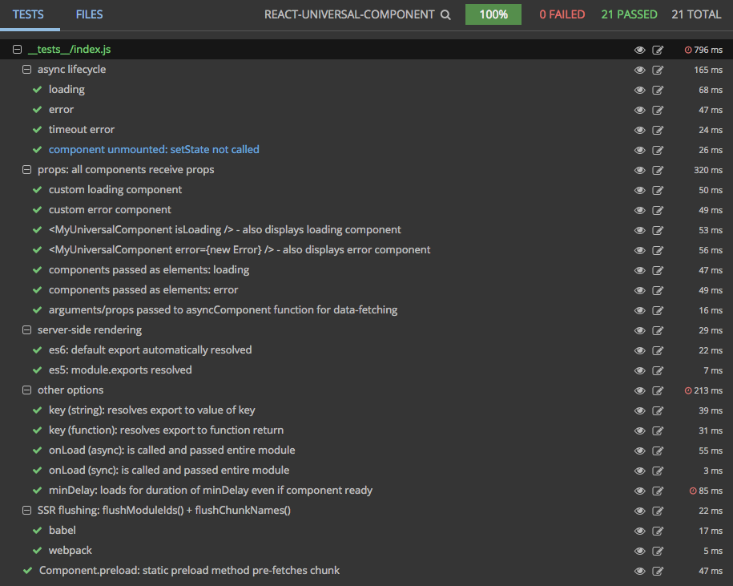

# React Universal Component

A simplified combination async/sync ("Universal") component inspired by React Loadable and other developments in the React/Webpack world, particularly [Webpack Flush Chunks](https://github.com/faceyspacey/webpack-flush-chunks). 

```js
import universal from 'react-universal-component'

const UniversalComponent = universal(() => import('../components/Foo'), {
  resolve: () => require.resolveWeak('./Foo')
})

export default () =>
  <div>
    <UniversalComponent />
  </div>
```


## Thanks

- **React Loadable** and **@thejameskyle** for paving the way and [discovering the path forward](https://medium.com/@thejameskyle/react-loadable-2674c59de178#.6h46yjgwr). This package is essentially the spiritual successor to *React Loadable*.
- **Vue** and its creator, **Evan You**, for inspiration for a [cleaner options API](https://vuejs.org/v2/guide/components.html#Advanced-Async-Components) and a `timeout` feature
- The Webpack team (and **@simenbrekken** for drawer my attention to) Webpack's latest ["magic comment"](https://vuejs.org/v2/guide/components.html#Advanced-Async-Components) feature which greatly simplifies serving chunks on the server
- **@djeeg** for his idea for the `onLoad` hook for doing things like replacing reducers
- **@richardscarrott** for providing a key element throughout this process: [webpack-hot-server-middleware](webpack-hot-server-middleware) which allows for the best universal HMR experience I've seen/had to date
- **@cletusw** for paving the way in what became [extract-css-chunks-webpack-plugin](https://github.com/faceyspacey/extract-css-chunks-webpack-plugin) via his [HMR support PR to extract-text-webpack-plugin](https://github.com/webpack-contrib/extract-text-webpack-plugin/pull/457)
- [async-reactor](https://github.com/xtuc/async-reactor) for indicating the problem of having 2 potentially simultaneous async fetching needs: *async component import* + *data-fetching*. The [`isLoading`](#props-api) prop passed to the component returned from the HoC is the outcome here.
- **Next.js** for being the first to offer any such feature for complete universal rendering, and for indicating the need for such capabilities in the greater NPM community. The 2 argument API of `universal` is also borrowed from their [`dynamic` HoC](https://github.com/zeit/next.js#dynamic-import).


## Installation

```yarn add react-universal-component```


## Motivation

To be the be-all-end-all async/sync "Universal" component for React. Just kidding. *Kinda*. In fact, that pursuit may never be over, which is why the core universal-rendering tools have been abstracted/extracted into its own package so you can easily accomplish any custom needs you might have: [require-universal-module](https://github.com/faceyspacey/require-universal-module).

That said, in combination with several other packages and the developments mentioned above, the story has come to a close for universal code-splitting in Reactlandia. See, the code has been cracked for while now for Server Side Rendering and Code-Splitting *individually*. Accomplishing both *simultaneously* has been an impossibility without jumping through major hoops (which few have succeeded at) or using a *framework*, specifically Next.js. This package essentially offers to the greater NPM community a general "front end" to the solution while [Webpack Flush Chunks](https://github.com/faceyspacey/webpack-flush-chunks) provides a general "back end."

***Quick story:*** basically I started on this journey to pick up where React Loadable left off and handle the challenge of serving the chunks corresponding to modules flushed by React Loadable. See, React Loadable only knows what modules were used, but not what chunks, and definitely not the corresponding scripts and stylesheets. And so [Webpack Flush Chunks](https://github.com/faceyspacey/webpack-flush-chunks) was born. Though Webpack's *"magic comment"* feature greatly simplifies pinpointing what chunks were used to render your *universal* component, *Webpack Flush Chunks* jumps through many hoops to determine what chunks to send from the server by triangulating what modules were rendered with the information of your webpack stats. It also must work with both Babel and Webpack servers. It must handle CSS chunks, and it must have first class support for HMR. After investing much time solving these problems--something I didn't really plan--the whole "stack" corresponding to this problem became important to me, and so I dreamt up what the ideal *universal* component should be, learning from all recent developments, and built it :). 

I won't go into much more about all the problems solved by the family of packages necessary to make this happen, so I'll point you to the Medium article where I describe it all

http://medium.com/@faceyspacey/foobar

## Other Packages you will need

https://github.com/faceyspacey/webpack-flush-chunks

*and if you want stylesheets chunks:*

https://github.com/faceyspacey/extract-css-chunks-webpack-plugin

Study [Webpack Flush Chunks](https://github.com/faceyspacey/webpack-flush-chunks) and its corresponding boilerplates to gain mastery of the webpack configuration you will need to bring this all together. 

## Most Basic Example


*src/App.js:*
```js
import React from 'react'
import universal from 'react-universal-component'

const UniversalComponent = universal(() => import('./Foo'), {
  resolve: () => require.resolveWeak('./Foo')
})

export default () =>
  <div>
    <UniversalComponent />
  </div>
```

*server/render.js:*
```js
import { flushModuleIds } from 'react-universal-component/server'
import flushChunks from 'webpack-flush-chunks'

export default function serverRender(req, res) => {
  const app = ReactDOMServer.renderToString(<App />)

  // see webpack-flush-chunks for great ways to get `webpackStats`
  const { js, styles } = flushChunks(webpackStats, { 
    moduleIds: flushModuleIds()
  })

  res.send(
    `<!doctype html>
      <html>
        <head>
          ${styles} // will contain stylesheets for: main.css, 0.css, 1.css, etc
        </head>
        <body>
          <div id="root">${app}</div>
          ${js} // will contain scripts for: bootstrap.js, 0.js, 1.js, etc, main.js
        </body>
      </html>`
  )
}
```

## API + Options


```js
universal(asyncComponent, options)
```
- `asyncComponent`: () => import('./Foo)

The first argument can be a function that returns a promise, or a promise itself, or a function that takes a node-style callback, which it can call with the module, as is useful if you are using Webpack's `require.ensure` directly. See [require-universal-module](https://github.com/faceyspacey/require-universal-module), which this package depends on, for advanced usage, such as how to use `require.ensure` which itself has a few capabilities beyond plain `import()`.

**The Options:**

All are optional except `resolve` and if you are using Babel on the server, you must also have `path`
- `loading`: LoadingComponent, -- *default: a simple one is provided for you*
- `error`: ErrorComponent, -- *default: a simple one is provided for you*
- `resolve`: `() => require.resolveWeak('./Foo')`
- `path`: `path.join(__dirname, './Example')`
- `key`: `'foo'` || `module => module.foo` -- *default: `default` export in ES6 and `module.exports` in ES5*
- `chunkName`: `'myChunkName'` 
- `timeout`: `15000` -- *default*
- `onLoad`: `module => doSomething(module)
- `minDelay`: `0` -- *default*


**In Depth:**
> All components can be classes/functions or elements (e.g: `Loading` or `<Loading />`)

- `loading` is the component class or function corresponding to your stateless component that displays while the primary import is loading. While testing out this package, you can leave it out as a simple default one is used.

- `error` similarly is the component that displays if there are any errors that occur during your aynschronous import. While testing out this package, you can leave it out as a simple default one is used.

- `resolve` is the most important and perhaps irregular option. It's always a call to Webpack's lesser-known `require.resolveWeak` function, which you must pass the same path you to pass to your `import()` call. All it does is tell Webpack not to include the given module in a dependency in the current chunk, thereby enabling your async call to `import()` to split the component out into a separate chunk *without it also being in the parent chunk*. It will be synchronously called on the server, as well as on the client. If it doesn't successfully return a module on the client, `import()` will be used when the component is actually rendered. See [Webpack Flush Chunks](https://github.com/faceyspacey/webpack-flush-chunks) for how to serve your split chunks.

- `path` is required only if you're using a Babel server. And again, its value must be the same path used in `import()` and `require.resolveWeak`, with the exception that it must be an absolute path. Keep in mind that even if you're using a Babel server, you *still* need to use `require.resolveWeak` for your `resolve` option so initial synchronous client-side renderings work as well.

- `key` lets you specify the export from the module you want to be your component if it's not `default` in ES6 or `module.exports` in ES5. It can be a string corresponding to the export key, or a function that's passed the entire module and returns the export that will become the component.

- `chunkName` is what will be flushed for you via `flushChunkNames()` along with any other universal components as part of server-side rendering. Keep in mind for Webpack to be aware of this, you need to define your `asyncComponent` like this: `import(/* webpackChunkName: 'myChunkName' /* './Foo'). *If you are not using Webpack magic comments, you use `flushModuleIds()` instead*. This is a feature that was introduced just a few weeks ago in Webpack 2.4.1. To learn more about it, checkout: https://webpack.js.org/guides/code-splitting-async/#chunk-names and again see [Webpack Flush Chunks](https://github.com/faceyspacey/webpack-flush-chunks) for server-side chunk flushing.

- `timeout` allows you to specify a maximum amount of time before the `error` component is displayed. The default is 15 seconds.

- `onLoad` is a callback function that receives the *entire* module. It allows you to export and put to use things other than your `default` component export, like reducers, sagas, etc. E.g: `onLoad: module => store.replaceReducer({ ...otherReducers, foo: module.fooReducer })`.

- `minDelay` is essentially the minimum amount of time the loading component will always show for. It's a different take on what *React Loadable* and Vue are doing, where no loading component will show for a given amount of milliseconds to avoid janky flashing between the `loading` component and the async component. What this offers is a controlled solution that is the most responsive. Rather than have a certain amount of milliseconds go by where nothing is shown, the loading component is shown instantly. It puts the control back in your hands for how the lifecycle from *render* to *loading* to *loaded* feels. In addition it solves a common problem I had which is this: I often have pages animate or slide in, while the page that's sliding in has a spinner showing in it. What is sub-optimal in this experience is if the async module loads during that sliding animation, the spinner is replaced with the entire async component and frames are dropped from the sliding animation as React re-renders. It becomes jank. So, say, you have a `500ms` CSS sliding transition, you can set `minDelay` to `500` to perfectly time the re-rendering for immediately after the page slides into place. As for the consequence of not letting your component load as quickly as possible, basically, the previous implementation suffers from the problem it tries to solve anyway: if the loading component starts at `200ms`, and then the async component renders at `230ms`, you still have some flashing jank. In conclusion, it's better just to perfectly time this and have a predictable minimal amount of time the spinner displays.

If you're wondering why things like `import()` and `require.resolveWeak()` must be called as a function, i.e. `() => import()`, there are a few scenarios where you don't have to. We don't have the benefit of whatever Next.js does in their transpilation to bypass this, but if within your own wrapping function or HoC, you may be able to avoid it. Both possibilities are ultimately allowed, though not documented here. Checkout [require-universal-module](https://github.com/faceyspacey/require-universal-module) for how to do this and an explanation of a few more possibilities for these options. Most these options are simply passed to that package.


## Module/Chunk Flushing

You saw this above. Below is an example of both options:
- `flushModuleIds()`
- and `flushChunkNames()`

```js
import { flushModuleIds, flushChunkNames } from 'react-universal-component/server'
import flushChunks from 'webpack-flush-chunks'

export default function serverRender(req, res) => {
  const app = ReactDOMServer.renderToString(<App />)

  const { js, styles } = flushChunks(webpackStats, { 
    moduleIds: flushModuleIds(),      // pick one or the other, not both
    // chunkNames: flushChunkNames(), // requires use of Webpack's magic comments
  })
```

As you can see, their usage is basically identical. Just make sure you're using Webpack's ["magic comment"](https://webpack.js.org/guides/code-splitting-async/#chunk-names) feature if you plan to call `flushChunkNames`. See [Webpack Flush Chunks](https://github.com/faceyspacey/webpack-flush-chunks) for how to put your Webpack configuration together.


## Preload

You can also preload the async component if there's a likelihood it will show soon:

```js
import universal from 'react-universal-component'

const UniversalComponent = universal(() => import('../components/Foo'), {
  resolve: () => require.resolveWeak('./Foo')
})

export default class MyComponent extends React.Component {
  componentWillMount() {
    UniversalComponent.preload()
  }

  render() {
    return <div>{this.props.visible && <UniversalComponent />}</div>
  }
}
```


## Props API

This package has one more evolution for you: you can pass `isLoading` and `error` props to the resulting component returned from the `universal` HoC. This has the convenient benefit of allowing you to continue to show the ***same*** `loading` component (or trigger the ***same*** `error` component) that is shown while your async component loads *AND* while any data-fetching may be occuring in a parent HoC. That means less jank from unnecessary re-renders, and less work (DRY).

Here's an example using Apollo:

```js
const UniversalUser = universal(() => import('./User'), {
  resolve: () => require.resolveWeak('./User')
})

const User = ({ loading, error, user }) =>
  <div>
    <UniversalUser isLoading={loading} error={error} user={user} />
  </div>

export default graphql(gql`
  query CurrentUser {
    user {
      id
      name
    }
  }
`, {
  props: ({ ownProps, data: { loading, error, user } }) => ({
    loading,
    error,
    user,
  }),
})(User)
```
> If it's not clear, the ***same*** `loading` component will show while both async aspects load, without flinching/re-rendering. And perhaps more importantly **they will be run in parallel**.


## Comparison to Other "Universal" Rendering Solutions

- **[Next.js](https://github.com/zeit/next.js):** CON: You gotta use a framework. Before this and `webpack-flush-chunks` came out, Next.js was the only game in town. If you're building a large custom app and/or are an expert in Webpack already, I wouldn't recommend sacrificing control to take on a framework. If you're new to Webpack, NPM, javascript development in general or you're a novice to intermediate developer it may be a fine option. Next.js started out only with route-based SSR + code-splitting in the fall of 2016. In the spring of 2017 they cracked the same nut that all this does as well, but, again, you're confined to the opinions, capabilities/limitations and potential workarounds that are typical of using a framework.

- **[Meteor](https://www.meteor.com):** Ok, now you're dealing with an even bigger framework. A true framework. ***Secret:*** I spent 3.5 years from 2012 to the beginning of 2016 dedicated to Meteor. Frameworks at that level or even *Next.js*'s level are done for me. No more. But it's really on you and your needs. You may be an expert developer from different languages that needs to jump into your first web app. Meteor will kick ass for you. ...But anyway, Meteor has recently (spring 2017) come out with their "exact code splitting" technique where they only serve the missing modules in async imports instead of whole chunks. It's amazing and spot-on, as with many things they do. The flaw I see though is this: they serve it over websockets. That means cycles on the server you're paying for to serve those modules, when Cloudflare would cache them in a CDN for free. Same with your primary chunks/modules. Next: I'm actually not even sure they have server-rendering. I've asked, but haven't had a response yet. They may just only have the async import aspect down, but not all the server-rendering stuff. Meteor has always been week when it comes to server-side rendering. But if they do (or when they do), great--Meteor has it's place, and if it's for you, you will go far.

- **[React Loadable](https://github.com/thejameskyle/react-loadable):** I consider `react-universal-component` the spiritual successor to *React Loadable*. The primary comparison is this package addresses 3-4 PRs yet to be merged into React Loadable (credit was given for most of them in the *Thanks* at the top of this readme) plus several other capabilities--if you're familiar with *React Loadable*--you already discerned. Secondly, it's built with a primary coupling to `webpack-flush-chunks` in mind, which brings everything full circle. They will stay updated together, etc. That said, you can use `webpack-flush-chunks` with React Loadable. If that's what you feel like doing, do it and get on with your life! However, this package has HMR which *React Loadable* doesn't. Those async imports, when using *React Loadable*, won't continue to update if you make some changes to them. Because of that, your developer experience will suffer and perhaps it's a good idea to just switch to `react-universal-component` sooner than later. That said, 2 months ago I put in a [PR](https://github.com/thejameskyle/react-loadable/pull/37) to give *React Loadable* HMR. I assume at some point it will get merged.

- **[Vue](https://github.com/vuejs/vue):** Our options API basically mimics [Vue's new async components](https://vuejs.org/v2/guide/components.html#Advanced-Async-Components). This one really isn't a comparison, as if you're using Vue, you should use that. If you're using React you should use this. The one thing to point out is that you may notice that they specify their `component` property simply with `import()`, not `() => import()`. But if you look carefully, this is happening within the context of a function. Vue internally clearly doesn't call this function until render time, so as not to simply just load all your imports the moment the page loads (which defeats the purpose of code-splitting). You can achieve the same thing (i.e. simply passing a promise) if you wrap your *universal component* in a function that you also call when it's actually needed. See [require-universal-module](https://github.com/faceyspacey/require-universal-module) for more about that.

- **[Async Reactor](https://github.com/xtuc/async-reactor):** Is a sweet solution that promotes stateless functional components and async data + import needs **all in one**. Ultimately the primary use case you can do with `react-universal-component` as well. That use-case is *data-fetching simultaneously while importing components* right along side your component definition (as a stateless component):

```js
const asyncWork = async (cb, props) => {
  const prom = await Promise.all([
    import('./User'),
    fetch(`/user?id=${props.id}`) // SECRET FEATURE: props are passed to async function for precisely this
  ])

  const Component = prom[0].default
  const data = await prom[1].json()

  return <Component data={data} />
}

const UniversalComponent = () => universal(asyncWork, {
  resolve: () => require.resolveWeak('./User'),
  key: mod => mod.default || mod // default export on server || <Component /> on client
})

<UniversalComponent id={123} />
```

If what you're saying to yourself is: "but how do you synchronously fetch the data on the server?" you'd be correct in having found the problem. The fact of the matter is *Async Reactor* offers no solution for server-rendering. So both solutions come with that caveat. That said, it's not a requirement that `react-universal-component` has to be used with server-rendering. If you wanted to use it just for it's async aspects, you could (just by leaving out both the `path` and `resolve` options). And therefore you could utilize the same pattern as Async Reactor. You just need to specify a dynamic `key` function that returns something different in each environment as shown above. 

That said, if we're still trying to achieve server-side rendering with this, there is something you can't do with `react-universal-component` that you can with `async-reactor`. That is in the latter you can have multiple module imports. In both you can have multiple async data-fetching tasks. However, here's the real thing: you actually shouldn't provide the `resolve` option, as on the server you will synchronously render something different than on the client (which leads to React checksum mismatches and re-rendering), since the client will have to display the `loading` component no matter what, while *all* async fetching is waited upon. Basically what it boils down to is rendering a `loading` component on the server and the same `loading` component on the client, and then additional async requests solely on the client. So, boom, you can do multiple module imports using `react-universal-component` in fact. You just have to forget all about synchronous rendering, and the result is you can do exactly what *Async Reactor* does. In fact, you can even specify `key: null` to always return the entire module, which in this case is `<UniversalComponent />`.

To complete this thought--because *Async Reactor*, in how it potentially allows for multiple imports + data on the server is quite compelling--let's think about how this could all work synchronously on the server. Basically, you gotta do something like what *Apollo* does with regards to server rendering. Here's how they handle promise resolution within rendered components on the server:

```js

import { renderToStringWithData } from "react-apollo"

export default async function serverRender(req, res) {
  const client = new ApolloClient(....)
  const content = await renderToStringWithData(app) // walk render tree and resolve all data-fetching promises

  const initialState = {[client.reduxRootKey]: client.getInitialState() }
  const html = <Html content={content} state={initialState} />
  res.send(`<!doctype html>\n${ReactDOM.renderToStaticMarkup(html)}`)
}
```
> Note: keep in mind dealing with promises (for imports or data) mixed into your component tree is a very different solution than the simplicity of dealing with modules that can render synchronously (like this package and *React Loadable* do). If you're going expend the effort, you better have good a reason [and lots of time].

So in short, *Async Reactor* would need a mechanism of its own that walks the component render tree and recursively resolves all promises (i.e. if after one promise resolves, it renders another component which fetches more data on mount, it must wait on and resolve those too). If it had that, it could cache the result for calls to `asyncReactor` within the follow-up *synchronous* render to pickup. 

What *Apollo* does here is fantastic, and to be clear: if you've designed your app correctly, you won't lose precious milliseconds waiting for recursive promises to resolve. It will just be one level deep. It's also highly efficient because it skips 2 of the 3 stages of React rendering: *diffing/reconciliation* + *rendering to the real DOM*. It basically only renders the virtual DOM (by manually calling the tree of all your render functions). It's a great solution. What I can't imagine and wouldn't like is having both *Apollo* + *Async Reactor* walk the render tree. Unless you forked *Apollo* and gave it the capability to simultaneously check for *Async Reactor* promises, you'd end up with 2 rounds of virtual DOM rendering--and all before the 3rd synchronous render! That's precious response time that is accumulating. 

I've seen ad hoc solutions that resolve promises and call `componentWillMount` async data fetching methods, and personally I'm against it. I recommend one of 2 solutions: use a routing solution (perhaps ad hoc) that determines your data needs and fetches them in parallel (`Promise.all`) and then dispatches the result as actions against your Redux store; ***and then render your app in one synchronous go***. OR secondly: use solutions dedicated to this problem like Meteor Development Group's *Apollo*. (Also, if it's not clear: this package will work perfectly with Apollo). The reason you're using Apollo is because it gets extreme value out of pairing your data-needs to components. With *Apollo*, you can use stateless component functions + slick HoCs--using `componentWillMount` and manually fetching data is a thing of the past. There's a trend of pairing data-needs to components, but I personally don't see it unless it's with GraphQL. If you're not using something like *Apollo*, figure out your data needs on the server and dispatch on your redux store before your single synchronous render. That's my conclusion and recommendation. The promise resolution stuff + sniffing out data fetching in `componentWillMount` is a mess unless someone else (*Apollo*) did it for you. I don't approve of ad hoc data-fetching in `componentWillMount`. I prefer my components truly pure unless it's with Apollo/Relay/Etc, other specialized HoCs or a [redux-specific routing solution](https://github.com/faceyspacey/redux-first-router) that handles it for you.

Now that all said, and taking into consideration *Next.js*, if the Apollo-style promise resolution was built into, say, *Webpack Flush Chunks* as another flushing technique, it would be the final nail in *Next.js's* coffin, as far as the greater NPM/React community is concerned. See, along with SSR + code-splitting + pre-fetching, their initial innovation was universal async data-fetching resolution: https://github.com/zeit/next.js#fetching-data-and-component-lifecycle ...What you're looking at there is the 2 function technique (`getInitialProps` + render function) that *Next.js* does to do what *Async Reactor* (and this package) can do in a single function by combining any async needs with a returned component. In ours you could return a function that returns a React component to continue to receive props from its parent, eg: 

``js
const asyncWork = async (cb, props) => {
  const prom = await Promise.all([
    import('./User'),
    fetch(`/user?id=${props.id}`) // SECRET FEATURE: props are passed to async function for precisely this
  ])

  const Component = prom[0].default
  const data = await prom[1].json()

  return props => <Component data={data} {...props} />
}

const UniversalComponent = () => universal(asyncWork, { asyncOnly: true } )
```
> This gets props from the same place (its parent), but it uses them in 2 different stages: once to get the initial data + modules to dynamically generate a component, and any time the parent updates props thereafter.

Sweet, huh! The only thing we're missing is the server-side aspect. I'm pretty happy with Apollo, but that requires GraphQL. So there is a bonafied need for this since it's my opinion that REST is here to stay for a wide variety of use cases. My apps gotta be pretty complex before I consider using Apollo. If someone wanted to provide PRs to this package and *Webpack Flush Chunks* I'd happily merge it and would work with them to polish it. What you need is a flag in the options to `universal` like `asyncOnly` to tell it that it won't be using synchronous module resolution (super simple) or just detection of the lack of `resolve` prop (even better), and then *Webpack Flush Chunks* needs something like Apollo's `await renderToStringWithData(app)`:

https://github.com/apollographql/react-apollo/blob/af2aac22d8e45aa7e3c30630b8cbbec27e30f2c1/src/server.ts#L126

That's basically all the code that's needed. Hell, I wonder if we simply added a `fetchData` method (like Apollo expects) to `ReactUniversalComponent`, if we could just run `renderToStringWithData` on our component tree and it would work lol. There seems to be no Apollo-specific code, just promise resolution. See the expected `fetcData` method on component instances here:

https://github.com/apollographql/react-apollo/blob/af2aac22d8e45aa7e3c30630b8cbbec27e30f2c1/src/server.ts#L111

*The change we'd need to make:*
```js
export default function universal(asyncComponent, options) {
  // ..
  return class UniversalComponent extends React.Component {
    fetchData() {
      return requireAsync()
    }
    // ...
```

**Insane! Stay tuned ;)**


Anyway, **what's the point in all this?**: a lot of work has been put into reviewing the trends, problems and all possible solutions so you don't have to. In the words of **@thejameskyle**, "use this shit!"


## FAQ

- **What about the Babel plugin from *React Loadable*?** Saving one or 2 lines is not something I'm concerned with. If it's something you want to maintain and keep up to date, feel free to make a PR. There is a [problem](https://github.com/thejameskyle/react-loadable/pull/43) with transpiling any HoCs you might make which wrap calls to `universal`. Perhaps the fact that `asyncComponent` is its own argument may make this an easier problem to solve here than with *React Loadable*.


## Contributing

We use [commitizen](https://github.com/commitizen/cz-cli), so run `npm run cm` to make commits. A command-line form will appear, requiring you answer a few questions to automatically produce a nicely formatted commit. Releases, semantic version numbers, tags, changelogs and publishing to NPM will automatically be handled based on these commits thanks to [semantic-release](https://github.com/semantic-release/semantic-release). Be good.


## Tests

Reviewing a module's tests are a great way to get familiar with it. It's direct insight into the capabilities of the given module (if the tests are thorough). What's even better is a screenshot of the tests neatly organized and grouped (you know the whole "a picture says a thousand words" thing). 

Below is a screenshot of this module's tests running in [Wallaby](https://wallabyjs.com) *("An Integrated Continuous Testing Tool for JavaScript")* which everyone in the React community should be using. It's fantastic and has taken my entire workflow to the next level. It re-runs your tests on every change along with comprehensive logging, bi-directional linking to your IDE, in-line code coverage indicators, **and even snapshot comparisons + updates for Jest!** I requestsed that feature by the way :). It's basically a substitute for live-coding that inspires you to test along your journey.



